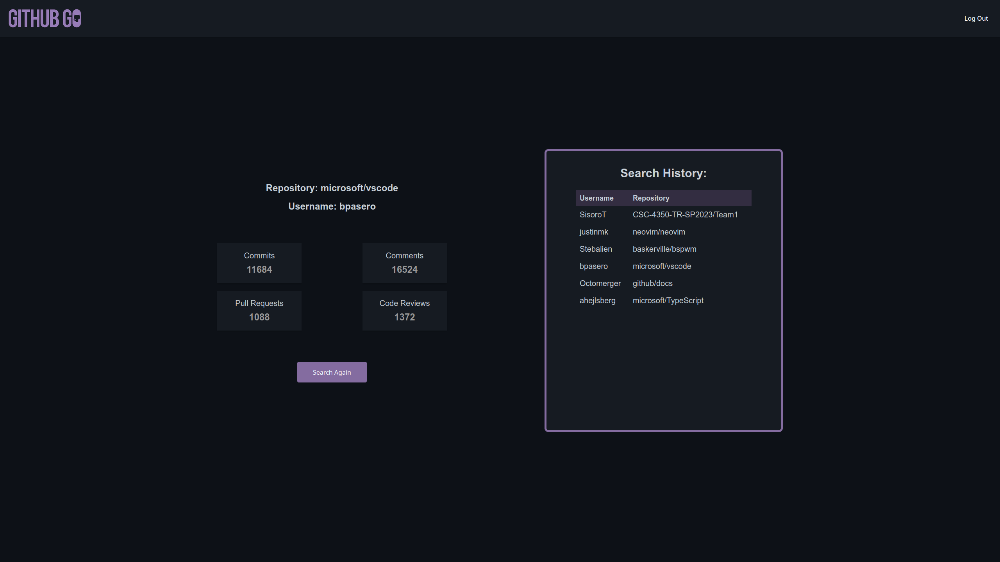

<!-- PROJECT LOGO -->
<div align="center">
    

  <p align="center">
    Gain Insights into Individual Contributions to Open Source Projects!
    <br/>
    <a href="https://user-images.githubusercontent.com/65800865/233450717-1246977b-7396-4ae8-88dc-47b412b6ebd7.mp4"><strong>View Demo »</strong></a>
  </p>
</div>

<!-- TABLE OF CONTENTS -->
<details>
  <summary>Table of Contents</summary>
  <ol>
    <li>
      <a href="#about-the-project">About The Project</a>
      <ul>
        <li><a href="#built-with">Built With</a></li>
      </ul>
    </li>
    <li>
      <a href="#getting-started">Getting Started</a>
      <ul>
        <li><a href="#prerequisites">Prerequisites</a></li>
        <li><a href="#installation">Installation</a></li>
      </ul>
    </li>
    <li><a href="#usage">Usage</a></li>
      <ul>
        <li><a href="#performing-a-search">Performing a Search</a></li>
        <li><a href="#search-history">Search History</a></li>
        <li><a href="#logging-in">Logging In</a></li>
        <li><a href="#database-page">Database Page</a></li>
      </ul>
    <li><a href="#contact">Contact</a></li>
  </ol>
</details>

<!-- ABOUT THE PROJECT -->

## About The Project

<p align="center">
  
</p>

**GitHub Go** is a powerful Flask-based web application designed to help you analyze an individual's contributions to a GitHub repository.
It provides a comprehensive view of a user's impact on a project by visualizing their commits, pull requests, issue comments, and code reviews.
The tool promotes transparency and collaboration within the open-source community and serves as a valuable resource for project management and team engagement.

This project was undertaken as part of my final year Software Engineering course in college.
As the lead developer, my primary focus was on the backend, where I extensively worked on GitHub API integration and database management.

### Built With

-   [![Flask][Flask-logo]][Flask-url]
-   [![Python][Python-logo]][Python-url]
-   [![HTML][HTML-logo]][HTML-url]
-   [![CSS][CSS-logo]][CSS-url]

<!-- GETTING STARTED -->

## Getting Started

Follow these steps to set up the project locally.

### Prerequisites

Ensure that Python and pip are installed on your system.

-   Python
    -   Follow the [official guide](https://www.python.org/downloads/) to install Python for your system.
-   pip
    -   If you don't already have pip installed, follow this [installation guide](https://pip.pypa.io/en/stable/installation/).

### Installation

1. Clone the GitHub Go repository and navigate to the cloned directory:
    ```sh
    git clone https://github.com/SisoroT/GitHub-Go.git
    ```
    ```sh
    cd GitHub-Go
    ```
2. Install the required packages using pip:
    ```sh
    pip3 install -r requirements.txt
    ```
3. Launch the Flask server:
    ```sh
    python3 app_service/app.py
    ```
4. Access GitHub Go by opening your preferred web browser and navigating to [localhost:5000](http://localhost:5000).

<!-- USAGE EXAMPLES -->

## Usage

**GitHub Go** leverages the GitHub API to perform searches. You can get a free API Key from the [Github Docs](https://docs.github.com/en/authentication/keeping-your-account-and-data-secure/creating-a-personal-access-token)

### Performing a search

To perform a search, input a complete repository name in the format `{owner}/{repository}` along with the username of the user whose contributions you'd like to explore.
After submitting, you will be redirected to the data page, which displays a comprehensive overview of the selected user's contributions to the specified repository.

https://user-images.githubusercontent.com/65800865/233450717-1246977b-7396-4ae8-88dc-47b412b6ebd7.mp4

### Search History

Logged-in users can access their search history on the right side of the data page.
This feature enables users to click on a previous search, rerun it, and view updated contribution information for the user and repository associated with the past search.

https://user-images.githubusercontent.com/65800865/233455562-46999d35-9db7-4b96-a949-25d21ac8fbc1.mp4

### Logging in

While **GitHub Go** does not require user authentication to conduct searches, logging in provides additional benefits.
Logged-in users can save their search history and API key in the database, allowing for seamless access to previous searches and eliminating the need to re-enter the API key after each session.

<p align="center">
  
</p>

### Database Page

Initially developed for testing purposes, the Database Page offers an effective way to visualize all data stored in the database.
It is not accessible through the main website, but you can reach it by navigating to [localhost:5000/db](http://localhost:5000/db) while the server is running.

<p align="center">
  
</p>

## Contact

Should you have any questions or need further assistance, please feel free to reach out to me via email at [rtaylor6410@gmail.com](mailto:rtaylor6410@gmail.com).
I'll be more than happy to help.

<!-- MARKDOWN LINKS & IMAGES -->
<!-- https://www.markdownguide.org/basic-syntax/#reference-style-links -->

[Flask-url]: https://flask.palletsprojects.com/
[Flask-logo]: https://img.shields.io/badge/Flask-000000?style=for-the-badge&logo=flask&logoColor=white
[Python-url]: https://www.python.org/
[Python-logo]: https://img.shields.io/badge/Python-FFD43B?style=for-the-badge&logo=python&logoColor=blue
[HTML-url]: https://developer.mozilla.org/en-US/docs/Web/HTML
[HTML-logo]: https://img.shields.io/badge/HTML5-E34F26?style=for-the-badge&logo=html5&logoColor=white
[CSS-url]: https://developer.mozilla.org/en-US/docs/Web/CSS
[CSS-logo]: https://img.shields.io/badge/CSS3-1572B6?style=for-the-badge&logo=css3&logoColor=white
